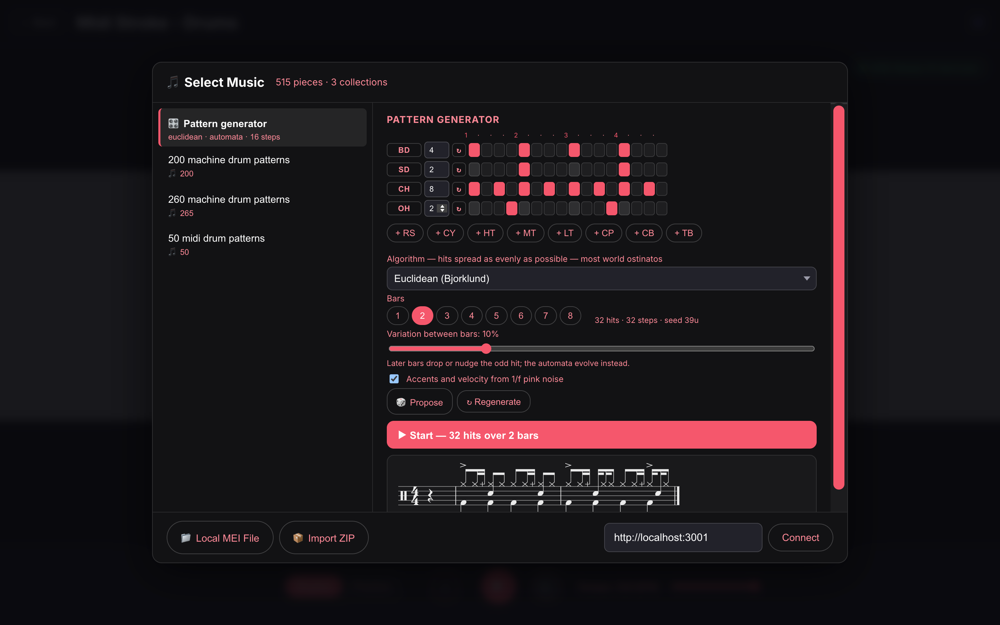
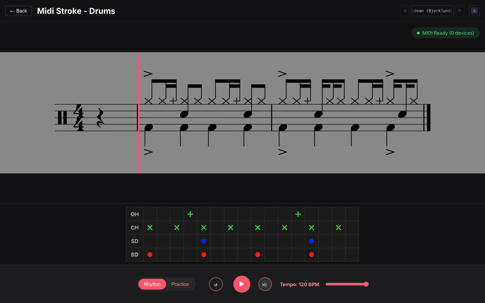
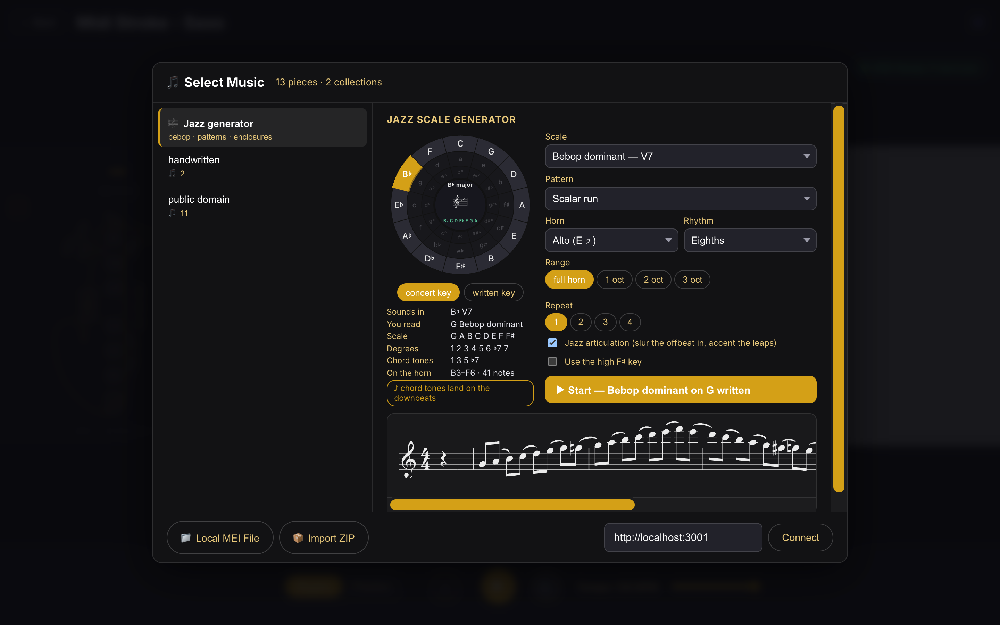
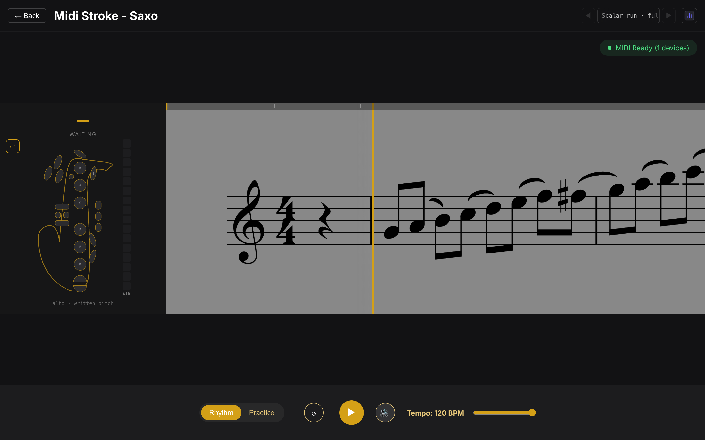

# Midi Stroke
### Precision-Engineered MIDI Training for Piano, Finger Drums, Saxophone & Music Theory

**Midi Stroke** is a high-performance, web-based training suite designed to bridge the gap between technical execution and professional music notation.
By leveraging real-time MIDI data and industry-standard rendering engines, it provides a data-driven environment for mastering melodic keys, rhythmic percussion, wind-controller saxophone, and written theory.

**▶ Use it now: [ms.vibetuned.com/app](https://ms.vibetuned.com/app/)** · **User guide: [ms.vibetuned.com](https://ms.vibetuned.com/)** · **Desktop app: [install it natively](#install)** · [releases](https://github.com/vibetuned/midi-stroke/releases) · [changelog](CHANGELOG.md)


---

## Install

Midi Stroke runs **in the browser** and as a **native desktop app** (Tauri) for
macOS, Windows and Linux. The desktop build is the same trainer with **native
MIDI** — the shell talks to CoreMIDI / WinMM / ALSA directly, so it needs no Web
MIDI support and hot-plugging devices just works. Everything else is identical
(same scores, modes, imports and stats — stored per app, so the desktop app and
your browser each keep their own).

| Platform | Install | Direct download |
|---|---|---|
| **macOS** | `brew install --cask vibetuned/tap/midi-stroke` | universal `.dmg`, signed + notarized |
| **Windows** | `winget install Vibetuned.MidiStroke` | `*-setup.exe` (NSIS) |
| **Debian / Ubuntu** | signed [apt repository](#debian--ubuntu--apt) | `.deb` |
| **Other Linux** | — | `.AppImage` |
| **Browser** | — | [ms.vibetuned.com/app](https://ms.vibetuned.com/app/) (PWA — installs and auto-updates) |

Every release attaches all four bundles to the
[GitHub releases](https://github.com/vibetuned/midi-stroke/releases) page (the
[latest release](https://github.com/vibetuned/midi-stroke/releases/latest) is
always the one to grab), and what each version ships is recorded in the
[changelog](CHANGELOG.md). The long version of this page, with screenshots, is
[ms.vibetuned.com/desktop](https://ms.vibetuned.com/desktop/).

### macOS — Homebrew

```sh
brew install --cask vibetuned/tap/midi-stroke
```

One universal build covering Apple Silicon and Intel, signed with Vibetuned's
Apple Developer ID and notarized by Apple — no Gatekeeper warning. `brew
upgrade` picks up new versions; the `.dmg` from the releases page installs the
same build by hand.

### Windows — winget

```sh
winget install Vibetuned.MidiStroke
```

Or run the `*-setup.exe` installer from the releases page — it bootstraps the
WebView2 runtime automatically if the machine doesn't have it. The installer is
not code-signed yet, so SmartScreen shows a warning on first run: *More info →
Run anyway*.

### Debian / Ubuntu — apt

The site hosts a signed apt repository, so releases arrive with the system's
regular updates:

```sh
sudo curl -fsSL https://ms.vibetuned.com/apt/midi-stroke.asc -o /etc/apt/keyrings/midi-stroke.asc
echo "deb [signed-by=/etc/apt/keyrings/midi-stroke.asc] https://ms.vibetuned.com/apt stable main" | sudo tee /etc/apt/sources.list.d/midi-stroke.list
sudo apt update && sudo apt install midi-stroke
```

(On a system without `/etc/apt/keyrings`, create it first:
`sudo install -m 0755 -d /etc/apt/keyrings`.) The `.deb` from the releases page
also installs standalone with `sudo apt install ./Midi.Stroke_<version>_amd64.deb`.

### Other Linux — AppImage

Grab the `.AppImage` from the releases page, make it executable, and run it:

```sh
chmod +x Midi.Stroke_*_amd64.AppImage
./Midi.Stroke_*_amd64.AppImage
```

### Browser

Nothing to install: open [ms.vibetuned.com/app](https://ms.vibetuned.com/app/)
in a browser with Web MIDI support (Chrome, Edge, Opera). It is a PWA, so it
installs to the desktop from the browser's own install button and auto-updates;
scores, stats and imports stay on-device.

---

## The Instruments

### 🎹 Piano — [docs/piano-app.md](docs/piano-app.md)

Grand-staff training with hand selection (L / R / L+R), key-range calibration, a sticky clef strip, a seekable minimap with wrong-note markers, and a full virtual keyboard that glows the expected keys per hand.


#### Scale generator

The song selector includes a technique-exercise generator: pick any major or minor key on a **circle of fifths** (natural, harmonic or melodic for minors) and it engraves the exercise on the fly — no score files involved. Eleven forms so far: parallel and contrary motion, scales in thirds/sixths/tenths, scale triads (harmonized scale), triad inversions, broken triads, tonic and dominant-seventh arpeggios, and cadences — each in quarters, eighths, sixteenths or triplets, over 1–4 octaves with optional repeats. Standard conservatory **fingering** is engraved on the staff (toggleable), and a live preview shows the exercise before you start.


Generated exercises play like any piece — same modes, tempo control and per-exercise stats (the exercise itself is the stable identity, so your precision history accumulates per key/form). As a practice guide, the virtual keyboard **grays out the keys that don't belong to the exercise's key** — below, E melodic minor leaves only F♮, G♯ and B♭ dimmed in every octave (they stay playable).


### 🥁 Drums — [docs/drums-app.md](docs/drums-app.md)

Finger-drumming training built for the **Yamaha FGDP-50**. Looping rhythm patterns on a percussion staff, with MEI-to-pad MIDI mapping and a step-sequencer grid that tracks the playhead column by column. Pads play a **synthesized drum kit** — twelve one-shot voices, velocity-sensitive, with a hi-hat that chokes and a limiter on the bus — rather than the piano sampler.


#### Pattern generator — [docs/drums-patterns.md](docs/drums-patterns.md)

Drums have no scales, so what you choose here is a **kit and a density**: a **16-step sequencer** where you pick the voices and how many times each one should hit in the bar, and one of the classical rhythm algorithms decides where those hits land. Every cell is editable by hand, and 🎲 **Propose** rolls playable numbers for the kit you assembled.



The engines are the standard ones, each answering *given k hits, which of the 16 steps*: **Euclidean** rhythms via Bjorklund's algorithm (the distribution behind most world ostinatos — E(5,8) is the Cuban cinquillo, E(4,16) four-on-the-floor), **metric-weighted Bernoulli** sampling against the hierarchy of the bar, a **shift-register Turing machine** that loops until you raise the variation, a **time-dependent Markov chain** that cannot lose the downbeat, and **cellular automata** (Wolfram rules 30, 90 and 110) that evolve one generation per bar. On top of those, later bars take **Bernoulli pulse jitter** so a repeat is a variation rather than a copy, and accents and velocities come from **1/f pink noise**, which makes dynamics group across a phrase the way a player's do.

The result is engraved as a real percussion score — two layers, kick stems down, beamed per beat, accents marked — and plays like any other piece, with the app's own step grid reading it back:



### 🎷 Saxo — [docs/saxo-app.md](docs/saxo-app.md)

Single-voice melodic training for wind controllers (built for the TravelSax). The score — transposed for E♭ alto — scrolls on the right, while a minimalist full-key saxophone on the left shows the fingering for each note: glowing keys to press, red keys to release, plus a live breath meter and a mirror toggle for beginners.


#### Jazz scale generator — [docs/saxo-scales.md](docs/saxo-scales.md)

The saxophone counterpart of the piano scale generator, built for jazz practice rather than conservatory technique. Pick a key on the **circle of fifths** — in **concert pitch**, so you think in the key the band is playing, and the part is engraved transposed for your horn (alto, tenor, soprano or baritone) — then a scale, a pattern, and how much of the instrument to cover.



The scales are the jazz vocabulary: the **bebop** scales, whose added chromatic passing tone puts the chord tones on the downbeats; the **melodic minor modes** (lydian dominant, altered, locrian ♯2 …); the **symmetrical** scales; and the pentatonic/blues family. The patterns are what players actually practise: scales in thirds, the digital cells (1-2-3-5, 3-5-7-9), triad pairs, and three kinds of chromatic **enclosure** around every chord tone. **Jazz articulation** slurs each offbeat into the downbeat and accents the top of every leap wider than a minor third.

Exercises are laid out on the **real keyed range** of the horn (written B♭3–F6, optionally the high F♯), so "full range" means the Bergonzi-style traversal — root up to the top of the instrument, down to the bottom, back to the root — not an abstract octave count. Generated exercises then play like any other piece, with their own stats:



### 🎼 Theory — [docs/theory-app.md](docs/theory-app.md)

A **train & practice course player**: each course module pairs lesson videos with fill-in-the-blank worksheet exercises rendered as real engraved scores. Instead of playing along with a transport, you *write* music — entering notes from the clickable virtual piano, the circle-of-fifths wheel, or a MIDI keyboard — then check your work, reveal the model answer, or listen to either. Courses (Elementary rudiments, Notation, …) live as content under `public/courses/`, with per-exercise progress and watched-video tracking persisted locally. Exercise types cover interval ear-tests, primary triads and inversions, cadence writing, passing/auxiliary notes, dominant sevenths and more.


---

## Documentation

| Doc | What it covers |
|---|---|
| [CHANGELOG.md](CHANGELOG.md) | What each release ships — features, install channels, and the platform behaviours probed along the way. |
| [docs/architecture.md](docs/architecture.md) | The shared engine: routing, `GameContext`, hooks, the Verovio→Pixi score pipeline, tick model, assets, stats, theming — plus the checklist for adding a new instrument. |
| [docs/piano-app.md](docs/piano-app.md) | The Piano app (reference implementation). |
| [docs/games.md](docs/games.md) | The Games tab: rhythm games that need no instrument — levels from lessons and library pieces, audio-clock timing and calibration, the Slingshot, results in notation. |
| [docs/accompaniment.md](docs/accompaniment.md) | Accompaniments: a recording synced to a piece and played along in Rhythm mode — the sync maths, the sync view, playback and storage. |
| [docs/learn-by-ear.md](docs/learn-by-ear.md) | The By ear mode (piano and saxo): additive call-and-response dictation, the veil, passages, the assessment, and the decisions behind it. |
| [docs/drums-app.md](docs/drums-app.md) | The Drums app and how it differs from Piano. |
| [docs/drums-patterns.md](docs/drums-patterns.md) | The Drums pattern generator: the 16-step sequencer, the Euclidean/Bernoulli/LFSR/Markov/automata engines, pink-noise dynamics, and the percussion engraving. |
| [docs/saxo-app.md](docs/saxo-app.md) | The Saxo app: design, offline score pipeline, transposition, fingering chart, TravelSax input. |
| [docs/saxo-scales.md](docs/saxo-scales.md) | The Saxo jazz scale generator: transposition/tessitura, the bebop and modern-jazz scales, patterns and enclosures, engraving and enharmonics. |
| [docs/theory-app.md](docs/theory-app.md) | The Theory app: course/module content model, worksheet exercise engine, video player, input instruments. |

---

## Technical Architecture

The application is built on a web stack trying to be optimized for low-latency audio processing and high-fidelity visual rendering:

* **React (Frontend):** Manages a reactive UI state, ensuring seamless synchronization between MIDI input and visual feedback.
* **Verovio (Notation Engine):** Renders **SMuFL-compliant** sheet music in real-time. By utilizing the MEI (Music Encoding Initiative) format, Midi Stroke provides professional-grade engraving that scales perfectly across all resolutions.
* **Pixi.js (Score Canvas):** The rendered score is rasterised into textures and scrolled on a WebGL canvas for smooth, frame-accurate playhead tracking.
* **Tone.js (Audio Framework):** Handles the web audio pipeline, providing scheduling and synthesis for internal metronomes and practice cues with sample-accurate precision.
* **Web MIDI API:** Facilitates direct, low-latency communication with external hardware, allowing for real-time velocity, timing, and breath-control analysis.

---

## Core Features

* **Hybrid Input Processing:** Specialized handling per instrument —
  - **Piano:** polyphonic, per-hand track filtering
  - **Finger Drums:** rhythmic, notation-pitch ↔ drum-pad mapping
  - **Saxophone:** monophonic wind-controller input with written-pitch transposition and breath (CC) capture
* **Dynamic Notation Mapping:** Interactive sheet music that responds to MIDI input, providing instant visual confirmation of accuracy.
* **Game Modes:** *Rhythm* (play along in time, scored with hit/miss windows), *Practice* (playback waits for the correct note), and on the piano and the saxophone *By ear*: hear a phrase, play it back from memory, and it grows by a note each time, with the score showing empty bars until each note has been played.
* **Games:** short rhythm games that need no instrument — a key, a tap or a pad. The first is the *Slingshot*: hold to orbit, let go to fling, and how long you hold is the note. Lessons teach one note value at a time, songs are the melodies of real pieces from the library, and the results show the rhythm written out, each note coloured by how it was played, with a way on to play the piece on an instrument.
* **Accompaniment (piano, saxo):** attach a recording to a piece (a backing track, a band, a teacher). Line it up once on its waveform, and it plays along in Rhythm mode, loops included.
* **Loop a passage:** drag the two handles on the minimap to choose bars. They loop in Rhythm and Practice, and By ear they choose the passage to learn.
* **Your kit's pad map (Drums):** each note a drum controller sends is assigned to a kit voice. The map starts as General MIDI and you can teach it any module's notes by hitting the pads.
* **Bring Your Own Scores:** load a single MEI file, or **import a ZIP of MEI scores** as a permanent on-device collection (stored in the browser's OPFS, offline-capable, delete anytime). Scores need no special preparation — the one-beat count-in measure (`n="0"`) is injected automatically at load time if missing.


* **Scale Generator (Piano):** technique exercises in all 24 keys engraved on demand — scales, intervals, triads, arpeggios and cadences with conservatory fingering — plus key-aware graying of the virtual keyboard.
* **Pattern Generator (Drums):** a 16-step sequencer where you set how many hits each voice plays, and Euclidean, Bernoulli, shift-register, Markov or cellular-automaton engines place them — with pink-noise accents and bar-to-bar variation.
* **Jazz Scale Generator (Saxo):** bebop scales, melodic-minor modes, symmetrical and blues scales in any concert key, engraved in written pitch for your horn across its full keyed range — with digital patterns, triad pairs, chromatic enclosures and jazz articulation.
* **Theory Courses:** video lessons paired with fill-in-the-blank score exercises, answered from piano, circle of fifths, or MIDI input.
* **Playback, in sound or in MIDI:** hear any piece or generated exercise — ▶ Listen in each builder auditions what you just built, and the transport can sound the score as it scrolls. Playback runs on the app's own instrument, or sends note-on/note-off to a MIDI output for your synth or DAW (drums go out as General MIDI pads on channel 10).
* **Instrument-appropriate sound:** the piano sampler for piano and theory, a reed synth for saxo, and a synthesized twelve-voice kit for drums — the drums app downloads nothing and works offline.
* **The score's own tempo:** a piece that states its tempo — `@midi.bpm`, the MIDI `@midi.mspb`, a metronome mark, or "♩ = 132" in the text — opens at it, follows its tempo changes as it plays, and keeps every section in proportion when you slow it down.
* **Precision Tempo Control:** A high-resolution transport system for granular practice, from slow-motion technical drills to full-speed performance.
* **Session Stats:** Per-song accuracy, combos, and history persisted locally.

---

## Building from source

To *use* Midi Stroke, install a release — see [Install](#install) above. This
section is for hacking on it.

### Prerequisites
* A MIDI-compatible keyboard, pad controller (e.g. Yamaha FGDP-50), or wind controller (e.g. TravelSax).
* Node 22 (what CI builds with) for the web app; a browser with Web MIDI API support (Chrome, Edge, Opera) to run it — the desktop shell needs neither.
* For the desktop shell: the [Rust toolchain](https://rustup.rs/), plus `libwebkit2gtk-4.1-dev`, `libasound2-dev` and `librsvg2-dev` on Linux, Xcode command-line tools on macOS, or the Visual Studio Build Tools C++ workload on Windows.

### The web app
1.  Clone the repository: `git clone https://github.com/vibetuned/midi-stroke.git`
2.  Install dependencies: `npm install`
3.  Launch the development server: `npm run dev`

### The desktop app (Tauri)

```sh
npm run tauri dev      # native shell against the dev server, hot reload included
npm run tauri build    # release bundles for whichever OS you are on
```

Bundles land in `src-tauri/target/release/bundle/`. Tauri does not
cross-compile — the webview is the native one on each platform (WKWebView,
WebView2, WebKitGTK), so every OS builds its own artifact; on macOS,
`rustup target add aarch64-apple-darwin x86_64-apple-darwin` and
`npm run tauri build -- --target universal-apple-darwin` produce the one
universal binary the Homebrew cask points at.

Releases are built by CI instead: pushing a `v*` tag runs
[.github/workflows/release.yml](.github/workflows/release.yml), which bundles
all four artifacts (signing and notarizing the macOS one) and attaches them to
a **draft** release. Publishing that draft is what updates the Homebrew cask,
the winget manifest and the apt repository — see the exact dependency list and
the per-platform bundle flags in that workflow.

### Score asset scripts

Saxophone scores live in `public/saxo/` as single-staff, alto-transposed MEI files:

```bash
npm run build:saxo               # derive saxo scores from piano MEI (drop bass, flatten chords, transpose up M6)
npm run build:saxo-manifest      # regenerate public/saxo_files.json by scanning public/saxo/ (run after adding songs)
npm run build:course-manifest    # regenerate the theory course manifest from public/courses/
node scripts/build-keysig-assets.mjs  # re-engrave the circle-of-fifths key-signature assets (src/assets/keySignatures.ts)
npm run check:jazz               # validate the saxo jazz generator (range, engraving vs MIDI, bebop downbeats)
npm run check:drums              # validate the drums pattern generator (hit counts, Euclidean references, engraving)
npm run check:tempo              # validate reading a score's tempo (every MEI encoding, change positions, the slider maths)
npm run check:ear                # validate Learn by ear against its acceptance criteria
npm run check:loop               # validate the minimap bar range (snapping, labels, by-ear passages)
npm run check:pads               # validate the drum pad map (GM default, remapping, every bundled chart)
npm run check:accompaniment      # validate lining a recording up with a score (offset, tempo, peaks, storage rules)
npm run check:games              # validate the rhythm games (lessons, song levels, judging, the Slingshot's course, calibration)
```

### Local Network Access

By default, the development server is only accessible on `localhost`. To allow access from other devices on your local network, you can use the `--host` flag:

```bash
npm run dev -- --host
```

This will make the development server accessible at `https://<your-ip>:5173` from other devices on your local network.

Since we are using webmidi that is gated behind "Secure Context" we need to use https, so we need to use a self-signed certificate.

In ubuntu you can generate a self-signed certificate using mkcert

First install mkcert and libnss3-tools:

```bash
sudo apt install mkcert libnss3-tools
```

Then generate the certificate:

```bash
mkdir certs
cd certs
mkcert -install
mkcert localhost 127.0.0.1 <your-ip>:
```
This will create a `localhost+2.pem` and `localhost+2-key.pem` file in the `certs` directory that are used by the vite.config.ts file.

As we are using self-signed certificates, you will need to add an exception in your browser to allow access to the development server.

If you are using the firewall ufw, you will need to allow the port 5173:

```bash
sudo ufw allow 5173
```

---

> **Note:** For the best experience, ensure your MIDI device is connected before launching the application to allow for automatic hardware detection.
