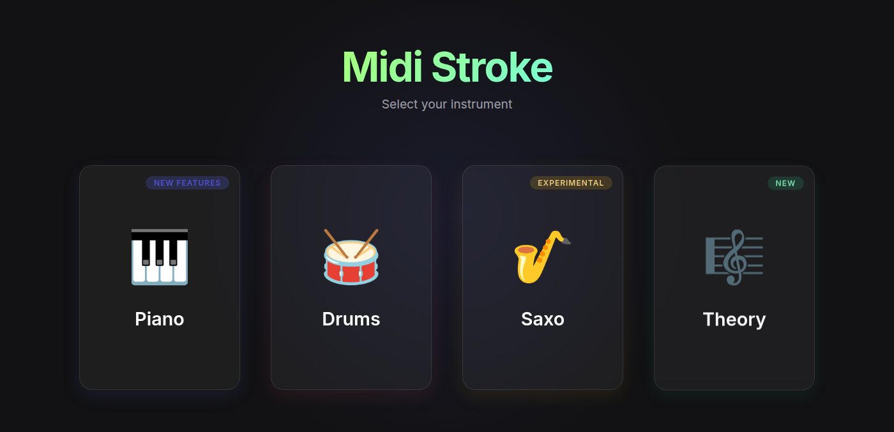
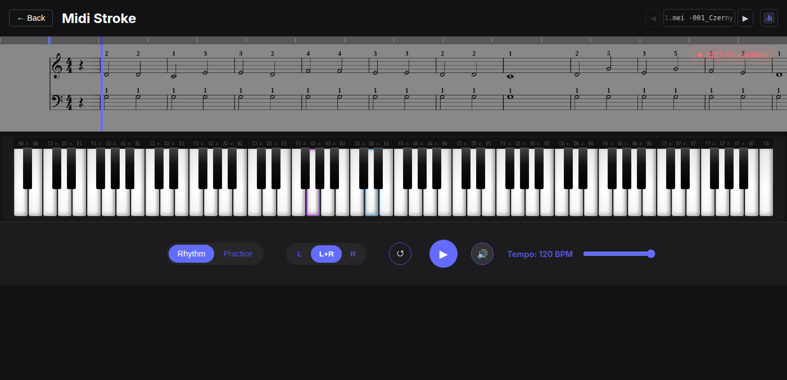
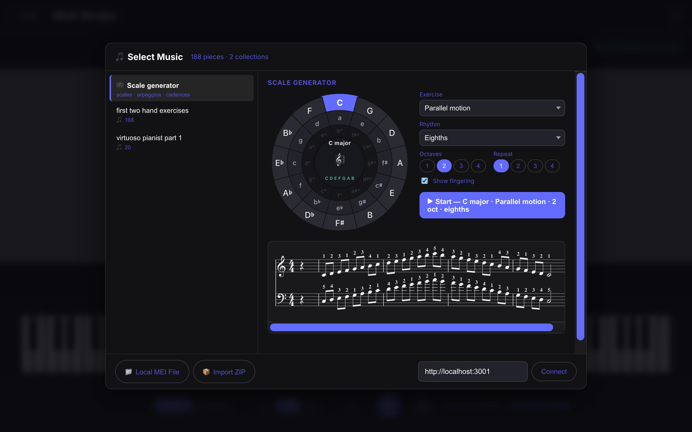
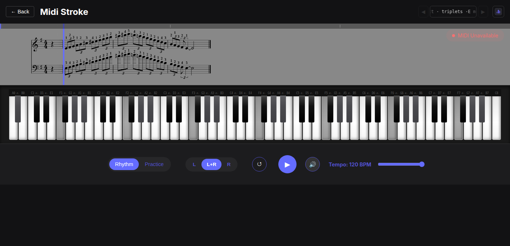
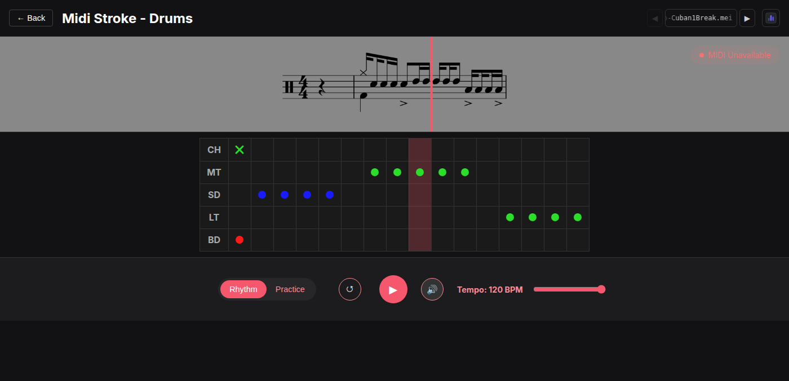
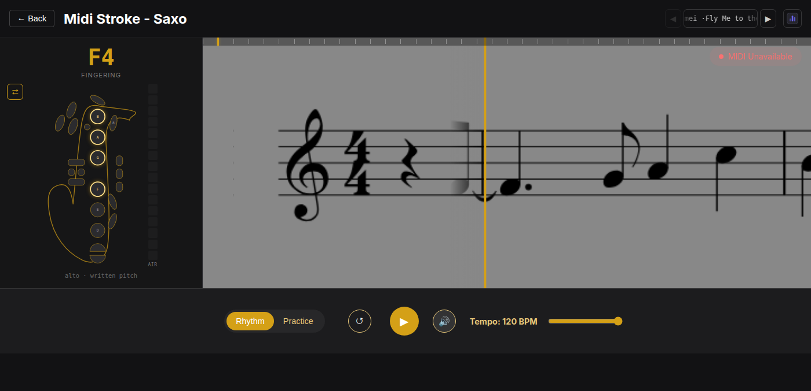
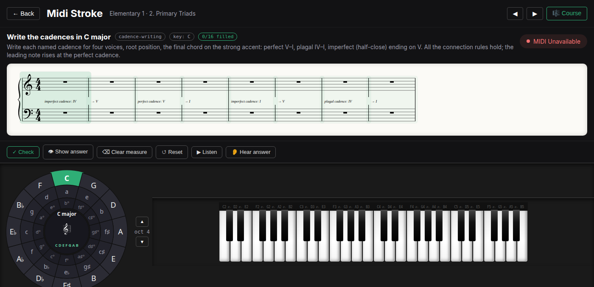
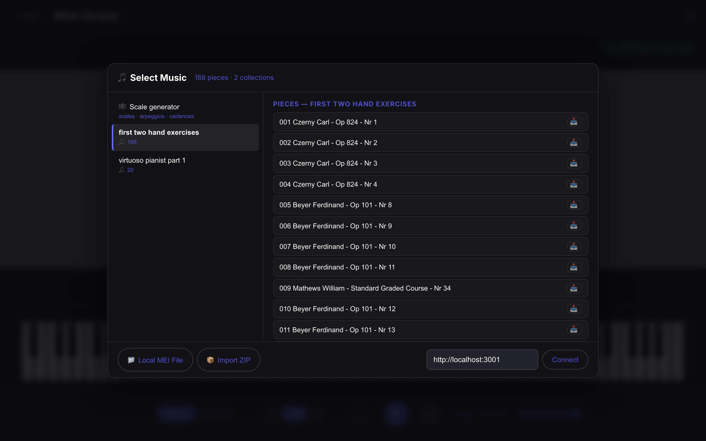

# Midi Stroke
### Precision-Engineered MIDI Training for Piano, Finger Drums, Saxophone & Music Theory

**Midi Stroke** is a high-performance, web-based training suite designed to bridge the gap between technical execution and professional music notation.
By leveraging real-time MIDI data and industry-standard rendering engines, it provides a data-driven environment for mastering melodic keys, rhythmic percussion, wind-controller saxophone, and written theory.

**▶ Use it now: [ms.vibetuned.com/app](https://ms.vibetuned.com/app/)** · **User guide: [ms.vibetuned.com](https://ms.vibetuned.com/)** · **Desktop app:** `brew install --cask vibetuned/tap/midi-stroke` (macOS) · [apt repo](https://ms.vibetuned.com/desktop/) (Debian/Ubuntu) · [releases](https://github.com/vibetuned/midi-stroke/releases)



---

## The Instruments

### 🎹 Piano — [docs/piano-app.md](docs/piano-app.md)

Grand-staff training with hand selection (L / R / L+R), key-range calibration, a sticky clef strip, a seekable minimap with wrong-note markers, and a full virtual keyboard that glows the expected keys per hand.



#### Scale generator

The song selector includes a technique-exercise generator: pick any major or minor key on a **circle of fifths** (natural, harmonic or melodic for minors) and it engraves the exercise on the fly — no score files involved. Eleven forms so far: parallel and contrary motion, scales in thirds/sixths/tenths, scale triads (harmonized scale), triad inversions, broken triads, tonic and dominant-seventh arpeggios, and cadences — each in quarters, eighths, sixteenths or triplets, over 1–4 octaves with optional repeats. Standard conservatory **fingering** is engraved on the staff (toggleable), and a live preview shows the exercise before you start.



Generated exercises play like any piece — same modes, tempo control and per-exercise stats (the exercise itself is the stable identity, so your precision history accumulates per key/form). As a practice guide, the virtual keyboard **grays out the keys that don't belong to the exercise's key** — below, E melodic minor leaves only F♮, G♯ and B♭ dimmed in every octave (they stay playable).



### 🥁 Drums — [docs/drums-app.md](docs/drums-app.md)

Finger-drumming training built for the **Yamaha FGDP-50**. Looping rhythm patterns on a percussion staff, with MEI-to-pad MIDI mapping and a step-sequencer grid that tracks the playhead column by column.



### 🎷 Saxo — [docs/saxo-app.md](docs/saxo-app.md)

Single-voice melodic training for wind controllers (built for the TravelSax). The score — transposed for E♭ alto — scrolls on the right, while a minimalist full-key saxophone on the left shows the fingering for each note: glowing keys to press, red keys to release, plus a live breath meter and a mirror toggle for beginners.



### 🎼 Theory — [docs/theory-app.md](docs/theory-app.md)

A **train & practice course player**: each course module pairs lesson videos with fill-in-the-blank worksheet exercises rendered as real engraved scores. Instead of playing along with a transport, you *write* music — entering notes from the clickable virtual piano, the circle-of-fifths wheel, or a MIDI keyboard — then check your work, reveal the model answer, or listen to either. Courses (Elementary rudiments, Notation, …) live as content under `public/courses/`, with per-exercise progress and watched-video tracking persisted locally. Exercise types cover interval ear-tests, primary triads and inversions, cadence writing, passing/auxiliary notes, dominant sevenths and more.



---

## Documentation

| Doc | What it covers |
|---|---|
| [docs/architecture.md](docs/architecture.md) | The shared engine: routing, `GameContext`, hooks, the Verovio→Pixi score pipeline, tick model, assets, stats, theming — plus the checklist for adding a new instrument. |
| [docs/piano-app.md](docs/piano-app.md) | The Piano app (reference implementation). |
| [docs/drums-app.md](docs/drums-app.md) | The Drums app and how it differs from Piano. |
| [docs/saxo-app.md](docs/saxo-app.md) | The Saxo app: design, offline score pipeline, transposition, fingering chart, TravelSax input. |
| [docs/theory-app.md](docs/theory-app.md) | The Theory app: course/module content model, worksheet exercise engine, video player, input instruments. |

---

## Technical Architecture

The application is built on a web stack trying to be optimized for low-latency audio processing and high-fidelity visual rendering:

* **React (Frontend):** Manages a reactive UI state, ensuring seamless synchronization between MIDI input and visual feedback.
* **Verovio (Notation Engine):** Renders **SMuFL-compliant** sheet music in real-time. By utilizing the MEI (Music Encoding Initiative) format, Midi Stroke provides professional-grade engraving that scales perfectly across all resolutions.
* **Pixi.js (Score Canvas):** The rendered score is rasterised into textures and scrolled on a WebGL canvas for smooth, frame-accurate playhead tracking.
* **Tone.js (Audio Framework):** Handles the web audio pipeline, providing scheduling and synthesis for internal metronomes and practice cues with sample-accurate precision.
* **Web MIDI API:** Facilitates direct, low-latency communication with external hardware, allowing for real-time velocity, timing, and breath-control analysis.

---

## Core Features

* **Hybrid Input Processing:** Specialized handling per instrument —
  - **Piano:** polyphonic, per-hand track filtering
  - **Finger Drums:** rhythmic, notation-pitch ↔ drum-pad mapping
  - **Saxophone:** monophonic wind-controller input with written-pitch transposition and breath (CC) capture
* **Dynamic Notation Mapping:** Interactive sheet music that responds to MIDI input, providing instant visual confirmation of accuracy.
* **Two Game Modes:** *Rhythm* (play along in time, scored with hit/miss windows) and *Practice* (playback waits for the correct note).
* **Bring Your Own Scores:** load a single MEI file, or **import a ZIP of MEI scores** as a permanent on-device collection (stored in the browser's OPFS, offline-capable, delete anytime). Scores need no special preparation — the one-beat count-in measure (`n="0"`) is injected automatically at load time if missing.


* **Scale Generator (Piano):** technique exercises in all 24 keys engraved on demand — scales, intervals, triads, arpeggios and cadences with conservatory fingering — plus key-aware graying of the virtual keyboard.
* **Theory Courses:** video lessons paired with fill-in-the-blank score exercises, answered from piano, circle of fifths, or MIDI input.
* **Precision Tempo Control:** A high-resolution transport system for granular practice, from slow-motion technical drills to full-speed performance.
* **Session Stats:** Per-song accuracy, combos, and history persisted locally.

---

## Getting Started

### Prerequisites
* A MIDI-compatible keyboard, pad controller (e.g. Yamaha FGDP-50), or wind controller (e.g. TravelSax).
* A modern web browser with Web MIDI API support (Chrome, Edge, Opera).

### Installation
1.  Clone the repository: `git clone https://github.com/your-username/midi-stroke.git`
2.  Install dependencies: `npm install`
3.  Launch the development server: `npm run dev`

### Score asset scripts

Saxophone scores live in `public/saxo/` as single-staff, alto-transposed MEI files:

```bash
npm run build:saxo               # derive saxo scores from piano MEI (drop bass, flatten chords, transpose up M6)
npm run build:saxo-manifest      # regenerate public/saxo_files.json by scanning public/saxo/ (run after adding songs)
npm run build:course-manifest    # regenerate the theory course manifest from public/courses/
node scripts/build-keysig-assets.mjs  # re-engrave the circle-of-fifths key-signature assets (src/assets/keySignatures.ts)
```

### Local Network Access

By default, the development server is only accessible on `localhost`. To allow access from other devices on your local network, you can use the `--host` flag:

```bash
npm run dev -- --host
```

This will make the development server accessible at `https://<your-ip>:5173` from other devices on your local network.

Since we are using webmidi that is gated behind "Secure Context" we need to use https, so we need to use a self-signed certificate.

In ubuntu you can generate a self-signed certificate using mkcert

First install mkcert and libnss3-tools:

```bash
sudo apt install mkcert libnss3-tools
```

Then generate the certificate:

```bash
mkdir certs
cd certs
mkcert -install
mkcert localhost 127.0.0.1 <your-ip>:
```
This will create a `localhost+2.pem` and `localhost+2-key.pem` file in the `certs` directory that are used by the vite.config.ts file.

As we are using self-signed certificates, you will need to add an exception in your browser to allow access to the development server.

If you are using the firewall ufw, you will need to allow the port 5173:

```bash
sudo ufw allow 5173
```

---

> **Note:** For the best experience, ensure your MIDI device is connected before launching the application to allow for automatic hardware detection.
